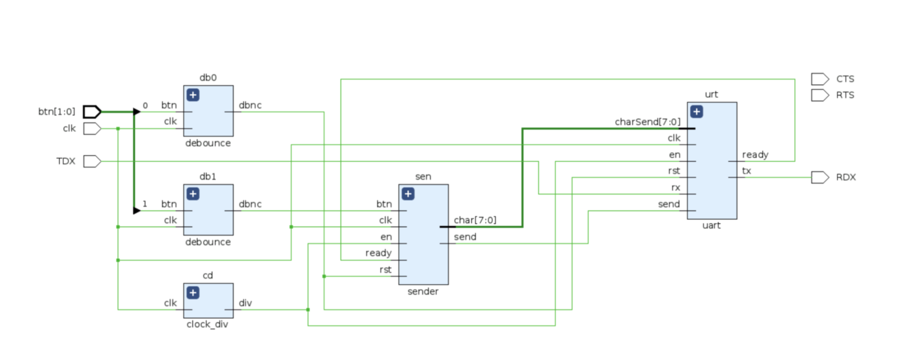
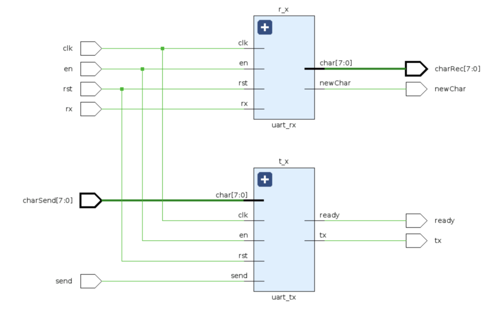
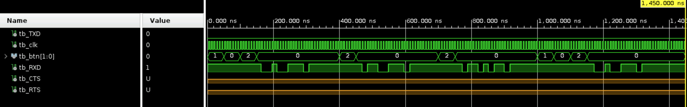
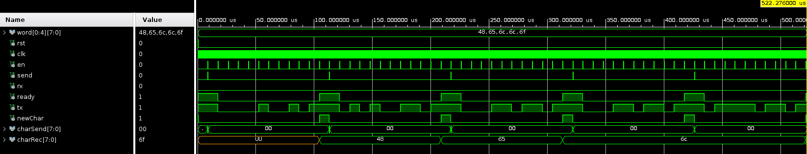
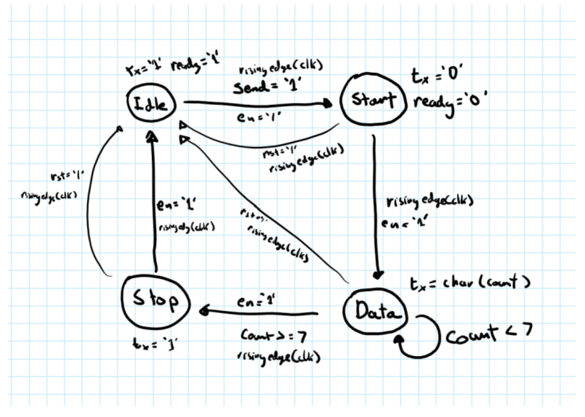

# 🔌 Embedded UART FSM

> A VHDL implementation of a UART (Universal Asynchronous Receiver-Transmitter) interface using finite state machines, designed for FPGA deployment with button-triggered message transmission.

<p align="center">
  
</p>

## 📖 Overview

This project implements a **complete UART communication system** on an FPGA development board using finite state machines (FSMs) in VHDL. The system demonstrates key digital design concepts including serial communication protocols, clock domain crossing via clock dividers, button debouncing, and FSM-based control logic.

When a button is pressed, the system transmits a pre-stored message (the creator's NETID) character-by-character over UART to a host computer. The design showcases proper hardware interfacing with PMOD connectors and real-world signal conditioning.

### ✨ Key Features

- 🔄 **Full UART Stack** - Complete transmitter and receiver with start/stop bit handling
- 🧠 **Finite State Machine Control** - FSM-based sender sequencing and UART state management
- 📡 **Majority-Vote Sampling** - 3-sample oversampling with majority voting for noise immunity in the receiver
- ⏱️ **Clock Division** - On-chip clock divider to generate the correct baud rate from the system clock
- 🔘 **Debounced Inputs** - Shift-register based button debouncing for clean edge detection
- 🔌 **PMOD Interface** - Direct PMOD connector mapping for RS-232/USB-UART bridge compatibility

## 🏗️ Architecture

<p align="center">
  
</p>

### System Components

| Module | Description |
|--------|-------------|
| [`top.vhd`](src/top.vhd) | Top-level entity connecting all modules and mapping PMOD signals |
| [`sender.vhd`](src/sender.vhd) | FSM-based message sender — sequences through stored characters on button press |
| [`uart.vhd`](src/uart.vhd) | UART top-level structural wrapper (connects TX + RX) |
| [`uart_tx.vhd`](src/uart_tx.vhd) | UART transmitter FSM — idle, start, data, stop states |
| [`uart_rx.vhd`](src/uart_rx.vhd) | UART receiver FSM — with majority-vote oversampling for noise immunity |
| [`clock_div.vhd`](src/clock_div.vhd) | Clock divider generating the UART enable tick from the 125 MHz/100 MHz system clock |
| [`debounce.vhd`](src/debounce.vhd) | Button debouncer using a shift register and counter |

## 📊 Simulation & Verification

### Top-Level Testbench

The top-level testbench verifies the full integration: button presses trigger character transmission through the UART pipeline:

<p align="center">
  
</p>

### UART Transceiver Testbench

The UART-specific testbench validates correct serial encoding/decoding, start/stop bit handling, and ready/ handshake signaling:

<p align="center">
  
</p>

### Sender FSM State Diagram

The sender uses a 4-state FSM to manage the transmit handshake:

<p align="center">
  
</p>

**States:**
- **Idle** — Wait for button press and `ready` signal from UART
- **BusyA/B/C** — Handle transmit handshake, clear `send` strobe, wait for button release before allowing next character

## 🔧 Technical Details

### UART Protocol (8N1)

The implementation uses standard **8N1** framing:
- 1 start bit (low)
- 8 data bits (LSB first)
- 1 stop bit (high)
- No parity

### Receiver Noise Immunity — Majority Vote

The RX module samples the incoming line 3× per bit period using a shift register. The `maj` signal is computed as the majority of the last 3 samples, effectively filtering out brief glitches:

```vhdl
if (inshift(3) = '1' and inshift(2) = '1' and inshift(1) = '1') or
   (inshift(3) = '1' and inshift(2) = '1') or
   (inshift(2) = '1' and inshift(1) = '1') or
   (inshift(3) = '1' and inshift(1) = '1') then
    maj <= '1';
else
    maj <= '0';
end if;
```

### Clock Divider

The clock divider generates a single-cycle enable pulse at the target baud rate. For a 125 MHz clock and divider count of 1085, the effective UART tick rate is approximately **115,200 baud**.

```vhdl
if (unsigned(counter) < 1085) then
    div <= '0';
    counter <= std_logic_vector(unsigned(counter) + 1);
else
    div <= '1';
    counter <= (others => '0');
end if;
```

## 🔌 Hardware Setup

### Required Hardware

| Component      | Details                                              |
| ---------------| -----------------------------------------------------|
| **FPGA Board** | Digilent Zybo Z7 or equivalent Zynq-7000 board       |
| **USB-UART**   | PMOD UART module or onboard USB-UART bridge          |
| **Serial Terminal** | PuTTY, Tera Term, or similar (115200 baud, 8N1) |

### PMOD Pin Mapping (via constraints.xdc)

All UART signals are routed to **PMOD Header JA** for easy connection to a USB-UART bridge:

| Signal | Pin | Direction | Description          |
|--------|-----|-----------|----------------------|
| `RTS`  | N15 | Output    | Request to Send      |
| `RXD`  | L14 | Output    | UART Transmit (FPGA → PC) |
| `TXD`  | K16 | Input     | UART Receive  (PC → FPGA) |
| `CTS`  | K14 | Output    | Clear to Send        |

> **Note:** `RXD`/`TXD` naming in the constraint file matches the PMOD bridge perspective: `RXD` is what the PC receives from the FPGA.

### Button Mapping

| Button | Pin | Function                |
|--------|-----|-------------------------|
| `btn[0]` | R18 | Reset (active high)     |
| `btn[1]` | P16 | Send next character     |

### Clock Constraint

```tcl
create_clock -add -name sys_clk_pin -period 8.00 -waveform {0 4} [get_ports { clk }];
```

This sets the system clock to **125 MHz** (`8 ns` period). Adjust the clock divider in [`clock_div.vhd`](src/clock_div.vhd) if using a different input frequency.

## 🚀 Getting Started

### Prerequisites

- Xilinx Vivado (or equivalent VHDL toolchain)
- FPGA development board with PMOD headers
- USB-UART PMOD module or cable
- Serial terminal application (e.g., PuTTY)

### Build & Deploy

1. **Clone the repository**
   ```bash
   git clone https://github.com/RonikKapadia/embedded-uart-fsm.git
   cd embedded-uart-fsm
   ```

2. **Open in Vivado**
   - Create a new project targeting your FPGA board (e.g., Zybo Z7)
   - Add all `.vhd` files from [`src/`](src/)
   - Add [`constraints.xdc`](src/constraints.xdc)
   - Set `top.vhd` as the top-level entity

3. **Synthesize, Implement, and Generate Bitstream**
   - Run through the standard Vivado flow
   - Program the FPGA

4. **Connect and Test**
   - Attach a USB-UART module to PMOD JA
   - Open a serial terminal at **115200 baud, 8 data bits, no parity, 1 stop bit (8N1)**
   - Press `btn[1]` to transmit the next character of the stored message
   - Press `btn[0]` to reset the message index

## 📁 Project Structure

```
embedded-uart-fsm/
├── 📂 assets/
│   ├── top_block_diagram.png    # Top-level system block diagram
│   ├── uart_block_diagram.png   # UART internal block diagram
│   ├── fsm_diagram.png          # Sender FSM state diagram
│   ├── top_tb.png               # Top-level testbench waveforms
│   └── uart_tb.png              # UART testbench waveforms
├── 📂 src/
│   ├── top.vhd                  # Top-level module
│   ├── sender.vhd               # FSM message sender
│   ├── uart.vhd                 # UART top-level wrapper
│   ├── uart_tx.vhd              # UART transmitter FSM
│   ├── uart_rx.vhd              # UART receiver FSM (with maj voting)
│   ├── clock_div.vhd            # Baud rate clock divider
│   ├── debounce.vhd             # Button debouncer
│   ├── constraints.xdc          # Zybo Z7 pin constraints
│   ├── make.bat                 # Build script
│   ├── check.bat                # Simulation/check script
│   └── view.bat                 # Waveform viewer script
└── README.md                    # This file!
```

## 🧪 Customization

### Changing the Transmitted Message

Edit the `MESSAGE` array in [`sender.vhd`](src/sender.vhd):

```vhdl
signal MESSAGE : str := (
    x"48", x"65", x"6C", x"6C", x"6F"  -- "Hello"
);
```

- Each entry is an ASCII hex value (`x"48"` = `'H'`)
- Update the array size (`str`) and comparison bounds in the FSM accordingly

### Adjusting Baud Rate

If your system clock differs from 125 MHz, recalculate the divider in [`clock_div.vhd`](src/clock_div.vhd):

```
divider = (clock_frequency / baud_rate) - 1
```

For 115,200 baud at 125 MHz: `125,000,000 / 115,200 ≈ 1085`

## 📄 License

This project is open-source and available for educational purposes. Feel free to fork, modify, and build upon it!

## 🙏 Credits & Acknowledgments

- **UART Receiver/Transmitter modules** (`uart_rx.vhd`, `uart_tx.vhd`, `uart.vhd`) written by **Gregory Leonberg**
